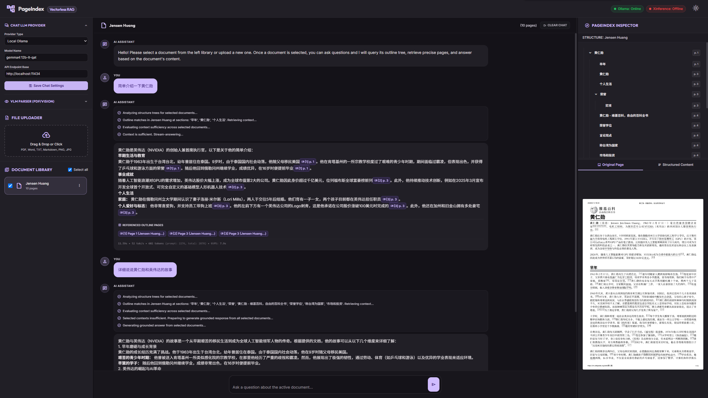

# PageIndex Local Multimodal RAG

An agentic, vectorless, local multimodal RAG application designed to index, explore, and chat with local documents (PDF, DOCX, TXT, MD, Images) using outline structure trees and visual VLM layout extraction.

---

## 🌟 Key Features

1. **Multi-Document Chat Selection**: Pick one or more documents from your library using checkboxes to serve as the context for your chat queries.
2. **Agentic Section/Node-Level Routing**: The RAG pipeline queries the document's outline tree first, routing queries to specific section nodes instead of flat pages. It retrieves the precise text chunk of the matched section, minimizing context window clutter.
3. **Hybrid PDF Parsing & Bookmarks Extraction**: PyMuPDF extracts digital text layers and native table-of-contents bookmarks. If bookmarks are missing, it heals the outline by scanning page content for missing references or header structures. VLM is used optionally to transcribe scanned images/charts.
4. **Interactive Node Inspector**: The right inspector panel features a dual-view (Original Page Image / Structured Markdown Text of the active section). Clickable citation pills in the chat automatically switch the inspected document and focus on the cited page.
5. **Robust Document Actions**: Rename, delete, and download original files directly from the Library actions menu. Renaming syncs disk image directories and upload paths, and deleting cleans up all cached files cleanly.
6. **Adjustable Split Layout**: Clean Material 3 style layout with drag-resizable split panes (Left Settings, Center Chat, Right Inspector) that persist pane widths in `localStorage`.



---

## 🛠️ Tech Stack & Architecture

* **Backend**: Python (FastAPI, Uvicorn, LiteLLM wrapper, PyMuPDF, python-docx, requests)
* **Frontend**: Vanilla HTML5, CSS3 (Material 3 variables, custom themes), Tailwind CSS CDN, Vanilla JS DOM API (pure browser events, `requestAnimationFrame`, `localStorage`)
* **Local Models**: Ollama or Xinference running LLM and VLM

---

## 🚀 Getting Started

### 1. Installation
Clone the repository and install the required Python packages:
```bash
pip install -r requirements.txt
```

### 2. Configure Local Services
Start your local Ollama or Xinference instances:
* **Ollama Default**: `http://localhost:11434`
* **Xinference Default**: `http://localhost:9997`

*(Ensure you have downloaded models with visual capability if using the VLM parser).*

### 3. Run the Application
Launch the FastAPI backend server:
```bash
python backend/app.py
```
By default, the server runs on `http://127.0.0.1:8088`. Open this address in your browser to start uploading files and chatting!

---

## 📚 Acknowledgments & References

This project utilizes and builds upon the following open-source tool:
* **[PageIndex](https://github.com/vectifyai/pageindex)**: A local document indexing utility used to construct outline hierarchical trees, generate node summaries, and segment page texts. Many thanks to the authors for this foundation.

---

## 📄 License

This project is licensed under the **MIT License**. Feel free to use, modify, and distribute it.
